Activity 3: Data visualization: fundamentals of ggplot
================

# National Park Visitation Data

Welcome! Today’s activity is all about the basics of making plots. We
will be using a “package” called `ggplot2.` More on packages later, but
packages are simply collections of pre-written functions that someone
else wrote and wants to share with the world (lucky us!). The `ggplot2`
package is all about making nice graphs (don’t ask me where ggplot1
went).

You will submit two outputs for this activity:

1.  A **PDF** of a rendered Quarto document with all of your R code (see
    below). Please include all of the code that appears in this
    document, in addition to adding your own code in the “Q#” sections.

2.  A plot and research question from the final section

How to render the Quarto document as PDF:

1.  In the YAML header of your Quarto document, replace the

*format: html*

bit with:

*format:*

*pdf: default*

*gfm: default*

1.  In your Terminal tab (next to console), enter the line of code
    `quarto install tinytex` and click enter.

Now, when you render the Quarto document, it should render as a PDF.

## Setting up

First, let’s install and load our packages. You should already have the
`here` package installed from last time, but you may not have `ggplot2`
installed. Install it in your console. Then, read it in from the library
in your code.

``` r
# install.packages("ggplot2")
library(ggplot2)
library(here)
```

## Reading in data

Next, let’s read in our data. Use the `read.csv()` function to read in
the dataframe. The name of the dataframe needs to be in quotes, and
because of the `here` package, R will recognize the .csv file if it is
in the same folder as your R script. Store the data as as data object
called `ci_np`.

Also, use the `head()` function to display the first handful of rows of
the stored dataframe

``` r
# Read in the data and store as "ci_np" data object
ci_np <- read.csv("ci_np.csv")

# display the first 6 rows
head(ci_np)
```

      region state code                     park_name          type visitors year
    1     PW    CA CHIS Channel Islands National Park National Park     1200 1963
    2     PW    CA CHIS Channel Islands National Park National Park     1500 1964
    3     PW    CA CHIS Channel Islands National Park National Park     1600 1965
    4     PW    CA CHIS Channel Islands National Park National Park      300 1966
    5     PW    CA CHIS Channel Islands National Park National Park    15700 1967
    6     PW    CA CHIS Channel Islands National Park National Park    31000 1968

Great! It looks like we have a dataframe with 7 columns of data. This
dataset is for the Channel Islands National Park visitation data. It
looks like the first 5 columns are categorical data, while the last two
(`visitors` and `year`) are continuous. Every row (every datapoint) is
the number of visitors for a given National Park in a given year.

### Q1: Fetch column names

Dataframes can be very large and have many columns; it is sometimes
useful to be able to concisely see all of the column names of a
dataframe. Just like with the `head()` function earlier, use the
`colnames()` function to retrieve and look at a vector of all of the
column names of this dataframe.

## Graphing basics

### Data and axes

Ok, now that we’ve checked out the data a little bit, let’s begin
graphing! Whenever we want to graph something, we use the function:
`ggplot()`. This sets up our graphing space. Let’s give the ggplot
function some data:

``` r
ggplot(data = ci_np)
```


What happens? A plotting window appears, but it’s empty! That’s because
we haven’t told the function which columns of data to display.

Here is where we can come up with a question that we want to answer.
Let’s ask: **How does the number of visitors to the Channel Islands
National Park change over time?**

To tell ggplot what to plot, we need to designate the “aesthetics” of
the graph using the `aes()` function. The aesthetics tell `ggplot()` how
the graph is going to look. Most importantly, you need an x and y axis!

Let’s try this again with ggplot’s “mapping” argument. To answer our
question, we will plot the two continuous variables: number of
`visitors` to the park and `year`. `Year` will be on the x-axis, as our
predictor variable, while `visitors` will be on the y-axis, as our
response variable. Remember to spell/capitalize the column names
correctly here!

``` r
ggplot(data = ci_np, mapping = aes(x = year, y = visitors))
```


Now what has changed? We have axis titles and numbers - great! But why
can’t we see any of the data? That’s because we need to tell ggplot what
kind of **graph** we want.

We do this using the built-in series of geom (graph type) functions.
These have the format of `geom_*()`, where `*` is a type of graph. For
example, `geom_point()` is a scatterplot, `geom_line()` is a line graph,
`geom_col()` is a column graph.

We add layers (including geoms) to a ggplot by putting a “+” after the
closed parenthesis of the `ggplot()` function and then creating a new
line with the geom we want.

Let’s make it a scatterplot, meaning we have a point for every
combination of `year` and `visitors`, using the `geom_point()` function.

``` r
ggplot(data = ci_np, mapping = aes(x = year, y = visitors)) +
  geom_point()
```

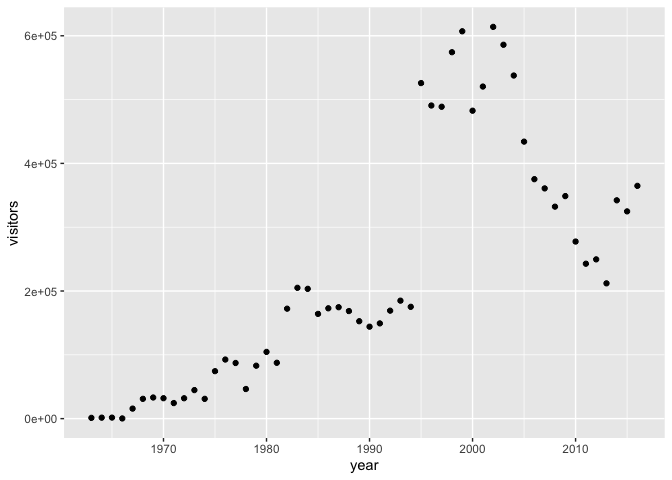

Now let’s try again using a column graph:

``` r
ggplot(data = ci_np, mapping = aes(x = year, y = visitors)) +
  geom_col()
```

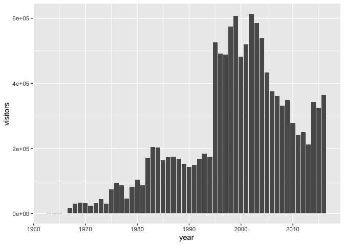

### Q2: Create a line plot

Replicate the same graph, but this time with a line graph.

You can add multiple geoms to one graph by simply adding another line
with a `+`. This layers the additional geoms on top of the ones that
come before it, so if you want to change the order of the geoms
(e.g. putting the line underneath the points, which may be relevant if
you add color…), just make sure the “bottom” layer comes first in the
code.

``` r
ggplot(data = ci_np, mapping = aes(x = year, y = visitors)) +
  geom_point() +
  geom_line()
```

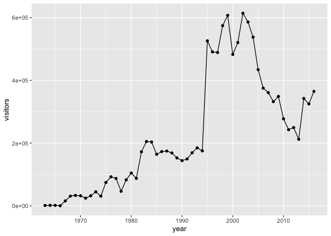

Another useful geom is `geom_smooth()`, which helps visualize patterns
in the data by fitting some basic models to the data (note: this does
not replace doing statistics on the data!)

``` r
ggplot(data = ci_np, mapping = aes(x = year, y = visitors)) +
  geom_point() +
  geom_smooth()
```

    `geom_smooth()` using method = 'loess' and formula = 'y ~ x'

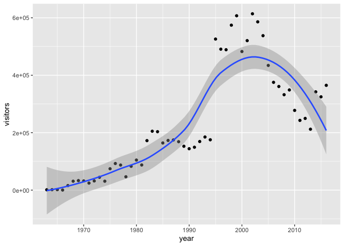

`geom_smooth()` has a `method =` argument, which, by default, uses a
method called “loess” (note that it gives you a little message saying
this). “loess” creates a dynamic line that follows the data like a
moving average. If you change this method to “lm”, the smoothing line
becomes a linear model line - a line with the formula `y = mx + b`. Try
it!

### Plotting only one variable

Sometimes we want to look at the distribution of a single continuous
variable to ask how the values are distributed (are there mostly small
values with a few large values as outliers?). We can do this using
`geom_histogram()` or `geom_density()`.

When we use these two functions, we only need to provide an x-axis in
the `aes()` and can skip the y-axis. Let’s use a histogram to look at
the distribution of the `visitors` variable:

``` r
ggplot(data = ci_np, mapping = aes(x = visitors)) +
  geom_histogram()
```

    `stat_bin()` using `bins = 30`. Pick better value `binwidth`.

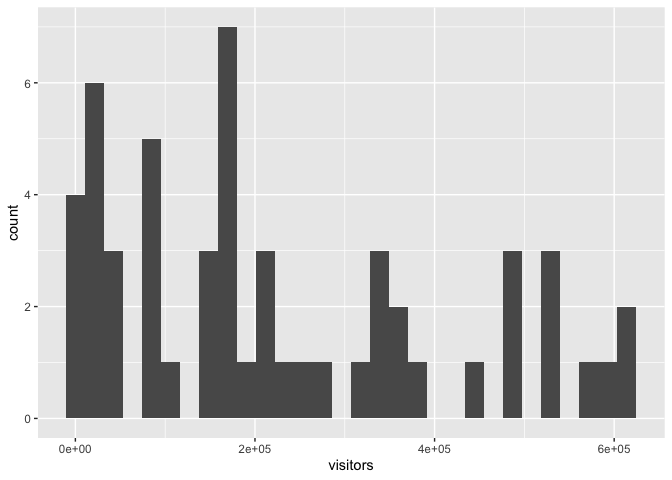

The `geom_histogram()` function takes all the values in the `visitors`
column and plops them into bins, then counts up how many of the values
fit into those bins. That count becomes the y-axis.

Alternately, we can use `geom_density()` which is a smoothed version of
a histogram. It does the same thing but fits a line to it, calculating
what’s called a “kernel density estimate”. Looks like the data in the
`visitors` column is mostly small values, with a healthy handful of
large values.

``` r
ggplot(data = ci_np, mapping = aes(x = visitors)) +
  geom_density()
```

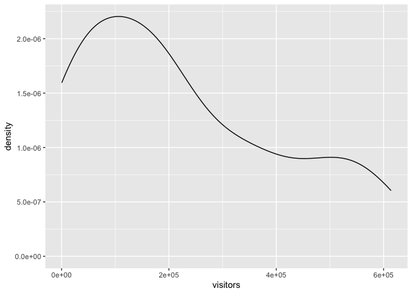

### Customizing things

Graphs in ggplot are highly customizable. We can modify all sorts of
aspects of this graph (**MUCH** more on this next class).

Some common arguments to modify aspects of the geoms are:

-   `color =` or `colour =`: update point or line colors
-   `fill =`: update fill color for objects with areas (like columns and
    certain point shapes)
-   `linetype =`: update the line type (dashed, long dash, etc.)
-   `shape =` or `pch =`: update the point shape/style
-   `size =`: update the element size (e.g. of points or line thickness)
-   `alpha =`: update element opacity (1 = opaque, 0 = transparent)

Let’s start by changing the shape and the color of the points. The
bottom of this handy cheatsheet has the possible shapes you can use,
numbered 0 through 25:
[*https://posit.co/wp-content/uploads/2022/10/data-visualization-1.pdf*](https://posit.co/wp-content/uploads/2022/10/data-visualization-1.pdf)

We modify specific, unchanging aspects of the points within the
geom_point function itself. What I mean by “unchanging” is that the
color, shape, etc, is going to be consistent across all points in the
graph.

``` r
ggplot(data = ci_np, mapping = aes(x = year, y = visitors)) +
  geom_point(shape = 8, color = "blue")
```


### Sidenote: Leaving out argument names

R knows what order the arguments of functions should be in. Up until
now, we have been defining the data and naming other arguments by
explicitly saying `ggplot(data = ci_np, mapping = aes(......))`.
However, you can omit the `data =` and `mapping =` as long as you keep
the order consistent! I will omit them for the rest of this lesson.

``` r
ggplot(ci_np, aes(x = year, y = visitors)) +
  geom_point(shape = 8, color = "blue")
```

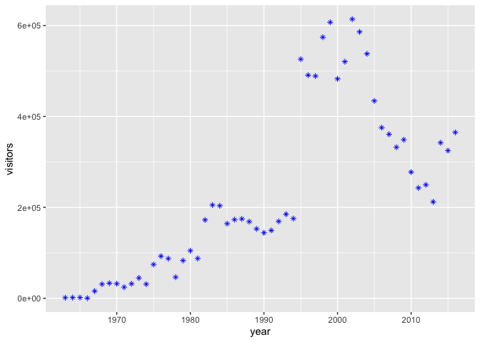

### Q3: Modify the lineplot

Let’s go back to the lineplot. Create the lineplot, but this time, with
a dashed linetype and a different colored line.

## Mapping other variables onto aesthetics

So far we’ve changed different elements (shape, color) of the geoms
based on constant inputs (i.e. the color is the same for every single
point). Often, though, we want to have different variables represented
in ways other than the x and y axes, such as having different colored
points for different categories of the data, or having points grow as
another value does. To do that, we will **map variables onto graph
aesthetics**, meaning we will change how an element on the graph looks
based on a different variable.

Let’s practice by making the size of the points vary with the `visitors`
column (which is also mapped onto our y-axis). When we want to customize
a graph element based on a variable’s value, add the element argument
within `aes()` in the appropriate `geom_*()` layer:

``` r
ggplot(ci_np, aes(x = year, y = visitors)) +
  geom_point(aes(size = visitors))
```

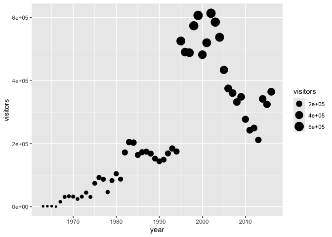

Neat! We can add in multiple aesthetics at once (though with this
example, things are getting unnecessarily complicated… Making clear and
concise graphs is an art!).

``` r
ggplot(ci_np, aes(x = year, y = visitors)) +
  geom_point(aes(size = visitors,
                 color = visitors))
```

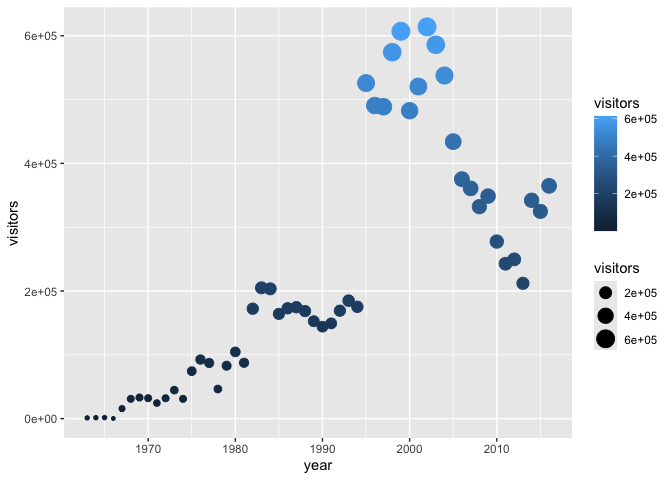

## Lots of parks all at once

### Q4: Reading in the new data

Let’s practice mapping additional aesthetics with an expanded dataset.
We’ve been working with the `ci_np` dataset, which includes only Channel
Islands National Park. The `ca_np.csv` dataset includes *all* California
National Parks! Read this .csv file in and store it as a data object
called `ca_np`

Once you’ve done that, let’s look at what parks are present in this new
dataset. You can create a vector from a column, isolating all of its
values in the order they appear in the dataframe, by putting a `$` after
the dataframe’s name: `dataframe$columnname`. Then, we can put that
output within the `unique()` function to remove duplicate values and see
what unique parks we have.

``` r
# Fetch the column only - not informative! Too many values!
ca_np$park_name
```

      [1] "Channel Islands National Park" "Channel Islands National Park"
      [3] "Channel Islands National Park" "Channel Islands National Park"
      [5] "Channel Islands National Park" "Channel Islands National Park"
      [7] "Channel Islands National Park" "Channel Islands National Park"
      [9] "Channel Islands National Park" "Channel Islands National Park"
     [11] "Channel Islands National Park" "Channel Islands National Park"
     [13] "Channel Islands National Park" "Channel Islands National Park"
     [15] "Channel Islands National Park" "Channel Islands National Park"
     [17] "Channel Islands National Park" "Channel Islands National Park"
     [19] "Channel Islands National Park" "Channel Islands National Park"
     [21] "Channel Islands National Park" "Channel Islands National Park"
     [23] "Channel Islands National Park" "Channel Islands National Park"
     [25] "Channel Islands National Park" "Channel Islands National Park"
     [27] "Channel Islands National Park" "Channel Islands National Park"
     [29] "Channel Islands National Park" "Channel Islands National Park"
     [31] "Channel Islands National Park" "Channel Islands National Park"
     [33] "Channel Islands National Park" "Channel Islands National Park"
     [35] "Channel Islands National Park" "Channel Islands National Park"
     [37] "Channel Islands National Park" "Channel Islands National Park"
     [39] "Channel Islands National Park" "Channel Islands National Park"
     [41] "Channel Islands National Park" "Channel Islands National Park"
     [43] "Channel Islands National Park" "Channel Islands National Park"
     [45] "Channel Islands National Park" "Channel Islands National Park"
     [47] "Channel Islands National Park" "Channel Islands National Park"
     [49] "Channel Islands National Park" "Channel Islands National Park"
     [51] "Channel Islands National Park" "Channel Islands National Park"
     [53] "Channel Islands National Park" "Channel Islands National Park"
     [55] "Death Valley National Park"    "Death Valley National Park"   
     [57] "Death Valley National Park"    "Death Valley National Park"   
     [59] "Death Valley National Park"    "Death Valley National Park"   
     [61] "Death Valley National Park"    "Death Valley National Park"   
     [63] "Death Valley National Park"    "Death Valley National Park"   
     [65] "Death Valley National Park"    "Death Valley National Park"   
     [67] "Death Valley National Park"    "Death Valley National Park"   
     [69] "Death Valley National Park"    "Death Valley National Park"   
     [71] "Death Valley National Park"    "Death Valley National Park"   
     [73] "Death Valley National Park"    "Death Valley National Park"   
     [75] "Death Valley National Park"    "Death Valley National Park"   
     [77] "Death Valley National Park"    "Death Valley National Park"   
     [79] "Death Valley National Park"    "Death Valley National Park"   
     [81] "Death Valley National Park"    "Death Valley National Park"   
     [83] "Death Valley National Park"    "Death Valley National Park"   
     [85] "Death Valley National Park"    "Death Valley National Park"   
     [87] "Death Valley National Park"    "Death Valley National Park"   
     [89] "Death Valley National Park"    "Death Valley National Park"   
     [91] "Death Valley National Park"    "Death Valley National Park"   
     [93] "Death Valley National Park"    "Death Valley National Park"   
     [95] "Death Valley National Park"    "Death Valley National Park"   
     [97] "Death Valley National Park"    "Death Valley National Park"   
     [99] "Death Valley National Park"    "Death Valley National Park"   
    [101] "Death Valley National Park"    "Death Valley National Park"   
    [103] "Death Valley National Park"    "Death Valley National Park"   
    [105] "Death Valley National Park"    "Death Valley National Park"   
    [107] "Death Valley National Park"    "Death Valley National Park"   
    [109] "Death Valley National Park"    "Death Valley National Park"   
    [111] "Death Valley National Park"    "Death Valley National Park"   
    [113] "Death Valley National Park"    "Death Valley National Park"   
    [115] "Death Valley National Park"    "Death Valley National Park"   
    [117] "Death Valley National Park"    "Death Valley National Park"   
    [119] "Death Valley National Park"    "Death Valley National Park"   
    [121] "Death Valley National Park"    "Death Valley National Park"   
    [123] "Death Valley National Park"    "Death Valley National Park"   
    [125] "Death Valley National Park"    "Death Valley National Park"   
    [127] "Death Valley National Park"    "Death Valley National Park"   
    [129] "Death Valley National Park"    "Death Valley National Park"   
    [131] "Death Valley National Park"    "Death Valley National Park"   
    [133] "Death Valley National Park"    "Death Valley National Park"   
    [135] "Death Valley National Park"    "Death Valley National Park"   
    [137] "Death Valley National Park"    "Death Valley National Park"   
    [139] "Joshua Tree National Park"     "Joshua Tree National Park"    
    [141] "Joshua Tree National Park"     "Joshua Tree National Park"    
    [143] "Joshua Tree National Park"     "Joshua Tree National Park"    
    [145] "Joshua Tree National Park"     "Joshua Tree National Park"    
    [147] "Joshua Tree National Park"     "Joshua Tree National Park"    
    [149] "Joshua Tree National Park"     "Joshua Tree National Park"    
    [151] "Joshua Tree National Park"     "Joshua Tree National Park"    
    [153] "Joshua Tree National Park"     "Joshua Tree National Park"    
    [155] "Joshua Tree National Park"     "Joshua Tree National Park"    
    [157] "Joshua Tree National Park"     "Joshua Tree National Park"    
    [159] "Joshua Tree National Park"     "Joshua Tree National Park"    
    [161] "Joshua Tree National Park"     "Joshua Tree National Park"    
    [163] "Joshua Tree National Park"     "Joshua Tree National Park"    
    [165] "Joshua Tree National Park"     "Joshua Tree National Park"    
    [167] "Joshua Tree National Park"     "Joshua Tree National Park"    
    [169] "Joshua Tree National Park"     "Joshua Tree National Park"    
    [171] "Joshua Tree National Park"     "Joshua Tree National Park"    
    [173] "Joshua Tree National Park"     "Joshua Tree National Park"    
    [175] "Joshua Tree National Park"     "Joshua Tree National Park"    
    [177] "Joshua Tree National Park"     "Joshua Tree National Park"    
    [179] "Joshua Tree National Park"     "Joshua Tree National Park"    
    [181] "Joshua Tree National Park"     "Joshua Tree National Park"    
    [183] "Joshua Tree National Park"     "Joshua Tree National Park"    
    [185] "Joshua Tree National Park"     "Joshua Tree National Park"    
    [187] "Joshua Tree National Park"     "Joshua Tree National Park"    
    [189] "Joshua Tree National Park"     "Joshua Tree National Park"    
    [191] "Joshua Tree National Park"     "Joshua Tree National Park"    
    [193] "Joshua Tree National Park"     "Joshua Tree National Park"    
    [195] "Joshua Tree National Park"     "Joshua Tree National Park"    
    [197] "Joshua Tree National Park"     "Joshua Tree National Park"    
    [199] "Joshua Tree National Park"     "Joshua Tree National Park"    
    [201] "Joshua Tree National Park"     "Joshua Tree National Park"    
    [203] "Joshua Tree National Park"     "Joshua Tree National Park"    
    [205] "Joshua Tree National Park"     "Joshua Tree National Park"    
    [207] "Joshua Tree National Park"     "Joshua Tree National Park"    
    [209] "Joshua Tree National Park"     "Joshua Tree National Park"    
    [211] "Joshua Tree National Park"     "Joshua Tree National Park"    
    [213] "Joshua Tree National Park"     "Joshua Tree National Park"    
    [215] "Kings Canyon National Park"    "Kings Canyon National Park"   
    [217] "Kings Canyon National Park"    "Kings Canyon National Park"   
    [219] "Kings Canyon National Park"    "Kings Canyon National Park"   
    [221] "Kings Canyon National Park"    "Kings Canyon National Park"   
    [223] "Kings Canyon National Park"    "Kings Canyon National Park"   
    [225] "Kings Canyon National Park"    "Kings Canyon National Park"   
    [227] "Kings Canyon National Park"    "Kings Canyon National Park"   
    [229] "Kings Canyon National Park"    "Kings Canyon National Park"   
    [231] "Kings Canyon National Park"    "Kings Canyon National Park"   
    [233] "Kings Canyon National Park"    "Kings Canyon National Park"   
    [235] "Kings Canyon National Park"    "Kings Canyon National Park"   
    [237] "Kings Canyon National Park"    "Kings Canyon National Park"   
    [239] "Kings Canyon National Park"    "Kings Canyon National Park"   
    [241] "Kings Canyon National Park"    "Kings Canyon National Park"   
    [243] "Kings Canyon National Park"    "Kings Canyon National Park"   
    [245] "Kings Canyon National Park"    "Kings Canyon National Park"   
    [247] "Kings Canyon National Park"    "Kings Canyon National Park"   
    [249] "Kings Canyon National Park"    "Kings Canyon National Park"   
    [251] "Kings Canyon National Park"    "Kings Canyon National Park"   
    [253] "Kings Canyon National Park"    "Kings Canyon National Park"   
    [255] "Kings Canyon National Park"    "Kings Canyon National Park"   
    [257] "Kings Canyon National Park"    "Kings Canyon National Park"   
    [259] "Kings Canyon National Park"    "Kings Canyon National Park"   
    [261] "Kings Canyon National Park"    "Kings Canyon National Park"   
    [263] "Kings Canyon National Park"    "Kings Canyon National Park"   
    [265] "Kings Canyon National Park"    "Kings Canyon National Park"   
    [267] "Kings Canyon National Park"    "Kings Canyon National Park"   
    [269] "Kings Canyon National Park"    "Kings Canyon National Park"   
    [271] "Kings Canyon National Park"    "Kings Canyon National Park"   
    [273] "Kings Canyon National Park"    "Kings Canyon National Park"   
    [275] "Kings Canyon National Park"    "Kings Canyon National Park"   
    [277] "Kings Canyon National Park"    "Kings Canyon National Park"   
    [279] "Kings Canyon National Park"    "Kings Canyon National Park"   
    [281] "Kings Canyon National Park"    "Kings Canyon National Park"   
    [283] "Kings Canyon National Park"    "Kings Canyon National Park"   
    [285] "Kings Canyon National Park"    "Kings Canyon National Park"   
    [287] "Kings Canyon National Park"    "Kings Canyon National Park"   
    [289] "Kings Canyon National Park"    "Kings Canyon National Park"   
    [291] "Kings Canyon National Park"    "Kings Canyon National Park"   
    [293] "Kings Canyon National Park"    "Kings Canyon National Park"   
    [295] "Kings Canyon National Park"    "Kings Canyon National Park"   
    [297] "Kings Canyon National Park"    "Kings Canyon National Park"   
    [299] "Kings Canyon National Park"    "Kings Canyon National Park"   
    [301] "Kings Canyon National Park"    "Kings Canyon National Park"   
    [303] "Kings Canyon National Park"    "Kings Canyon National Park"   
    [305] "Kings Canyon National Park"    "Kings Canyon National Park"   
    [307] "Kings Canyon National Park"    "Kings Canyon National Park"   
    [309] "Kings Canyon National Park"    "Kings Canyon National Park"   
    [311] "Kings Canyon National Park"    "Kings Canyon National Park"   
    [313] "Kings Canyon National Park"    "Kings Canyon National Park"   
    [315] "Kings Canyon National Park"    "Kings Canyon National Park"   
    [317] "Kings Canyon National Park"    "Kings Canyon National Park"   
    [319] "Kings Canyon National Park"    "Kings Canyon National Park"   
    [321] "Kings Canyon National Park"    "Kings Canyon National Park"   
    [323] "Kings Canyon National Park"    "Kings Canyon National Park"   
    [325] "Kings Canyon National Park"    "Kings Canyon National Park"   
    [327] "Kings Canyon National Park"    "Lassen Volcanic National Park"
    [329] "Lassen Volcanic National Park" "Lassen Volcanic National Park"
    [331] "Lassen Volcanic National Park" "Lassen Volcanic National Park"
    [333] "Lassen Volcanic National Park" "Lassen Volcanic National Park"
    [335] "Lassen Volcanic National Park" "Lassen Volcanic National Park"
    [337] "Lassen Volcanic National Park" "Lassen Volcanic National Park"
    [339] "Lassen Volcanic National Park" "Lassen Volcanic National Park"
    [341] "Lassen Volcanic National Park" "Lassen Volcanic National Park"
    [343] "Lassen Volcanic National Park" "Lassen Volcanic National Park"
    [345] "Lassen Volcanic National Park" "Lassen Volcanic National Park"
    [347] "Lassen Volcanic National Park" "Lassen Volcanic National Park"
    [349] "Lassen Volcanic National Park" "Lassen Volcanic National Park"
    [351] "Lassen Volcanic National Park" "Lassen Volcanic National Park"
    [353] "Lassen Volcanic National Park" "Lassen Volcanic National Park"
    [355] "Lassen Volcanic National Park" "Lassen Volcanic National Park"
    [357] "Lassen Volcanic National Park" "Lassen Volcanic National Park"
    [359] "Lassen Volcanic National Park" "Lassen Volcanic National Park"
    [361] "Lassen Volcanic National Park" "Lassen Volcanic National Park"
    [363] "Lassen Volcanic National Park" "Lassen Volcanic National Park"
    [365] "Lassen Volcanic National Park" "Lassen Volcanic National Park"
    [367] "Lassen Volcanic National Park" "Lassen Volcanic National Park"
    [369] "Lassen Volcanic National Park" "Lassen Volcanic National Park"
    [371] "Lassen Volcanic National Park" "Lassen Volcanic National Park"
    [373] "Lassen Volcanic National Park" "Lassen Volcanic National Park"
    [375] "Lassen Volcanic National Park" "Lassen Volcanic National Park"
    [377] "Lassen Volcanic National Park" "Lassen Volcanic National Park"
    [379] "Lassen Volcanic National Park" "Lassen Volcanic National Park"
    [381] "Lassen Volcanic National Park" "Lassen Volcanic National Park"
    [383] "Lassen Volcanic National Park" "Lassen Volcanic National Park"
    [385] "Lassen Volcanic National Park" "Lassen Volcanic National Park"
    [387] "Lassen Volcanic National Park" "Lassen Volcanic National Park"
    [389] "Lassen Volcanic National Park" "Lassen Volcanic National Park"
    [391] "Lassen Volcanic National Park" "Lassen Volcanic National Park"
    [393] "Lassen Volcanic National Park" "Lassen Volcanic National Park"
    [395] "Lassen Volcanic National Park" "Lassen Volcanic National Park"
    [397] "Lassen Volcanic National Park" "Lassen Volcanic National Park"
    [399] "Lassen Volcanic National Park" "Lassen Volcanic National Park"
    [401] "Lassen Volcanic National Park" "Lassen Volcanic National Park"
    [403] "Lassen Volcanic National Park" "Lassen Volcanic National Park"
    [405] "Lassen Volcanic National Park" "Lassen Volcanic National Park"
    [407] "Lassen Volcanic National Park" "Lassen Volcanic National Park"
    [409] "Lassen Volcanic National Park" "Lassen Volcanic National Park"
    [411] "Lassen Volcanic National Park" "Lassen Volcanic National Park"
    [413] "Lassen Volcanic National Park" "Lassen Volcanic National Park"
    [415] "Lassen Volcanic National Park" "Lassen Volcanic National Park"
    [417] "Lassen Volcanic National Park" "Lassen Volcanic National Park"
    [419] "Lassen Volcanic National Park" "Lassen Volcanic National Park"
    [421] "Lassen Volcanic National Park" "Lassen Volcanic National Park"
    [423] "Lassen Volcanic National Park" "Lassen Volcanic National Park"
    [425] "Lassen Volcanic National Park" "Lassen Volcanic National Park"
    [427] "Lassen Volcanic National Park" "Pinnacles National Park"      
    [429] "Pinnacles National Park"       "Pinnacles National Park"      
    [431] "Pinnacles National Park"       "Pinnacles National Park"      
    [433] "Pinnacles National Park"       "Pinnacles National Park"      
    [435] "Pinnacles National Park"       "Pinnacles National Park"      
    [437] "Pinnacles National Park"       "Pinnacles National Park"      
    [439] "Pinnacles National Park"       "Pinnacles National Park"      
    [441] "Pinnacles National Park"       "Pinnacles National Park"      
    [443] "Pinnacles National Park"       "Pinnacles National Park"      
    [445] "Pinnacles National Park"       "Pinnacles National Park"      
    [447] "Pinnacles National Park"       "Pinnacles National Park"      
    [449] "Pinnacles National Park"       "Pinnacles National Park"      
    [451] "Pinnacles National Park"       "Pinnacles National Park"      
    [453] "Pinnacles National Park"       "Pinnacles National Park"      
    [455] "Pinnacles National Park"       "Pinnacles National Park"      
    [457] "Pinnacles National Park"       "Pinnacles National Park"      
    [459] "Pinnacles National Park"       "Pinnacles National Park"      
    [461] "Pinnacles National Park"       "Pinnacles National Park"      
    [463] "Pinnacles National Park"       "Pinnacles National Park"      
    [465] "Pinnacles National Park"       "Pinnacles National Park"      
    [467] "Pinnacles National Park"       "Pinnacles National Park"      
    [469] "Pinnacles National Park"       "Pinnacles National Park"      
    [471] "Pinnacles National Park"       "Pinnacles National Park"      
    [473] "Pinnacles National Park"       "Pinnacles National Park"      
    [475] "Pinnacles National Park"       "Pinnacles National Park"      
    [477] "Pinnacles National Park"       "Pinnacles National Park"      
    [479] "Pinnacles National Park"       "Pinnacles National Park"      
    [481] "Pinnacles National Park"       "Pinnacles National Park"      
    [483] "Pinnacles National Park"       "Pinnacles National Park"      
    [485] "Pinnacles National Park"       "Pinnacles National Park"      
    [487] "Pinnacles National Park"       "Pinnacles National Park"      
    [489] "Pinnacles National Park"       "Pinnacles National Park"      
    [491] "Pinnacles National Park"       "Pinnacles National Park"      
    [493] "Pinnacles National Park"       "Pinnacles National Park"      
    [495] "Pinnacles National Park"       "Pinnacles National Park"      
    [497] "Pinnacles National Park"       "Pinnacles National Park"      
    [499] "Pinnacles National Park"       "Pinnacles National Park"      
    [501] "Pinnacles National Park"       "Pinnacles National Park"      
    [503] "Pinnacles National Park"       "Pinnacles National Park"      
    [505] "Pinnacles National Park"       "Pinnacles National Park"      
    [507] "Pinnacles National Park"       "Pinnacles National Park"      
    [509] "Pinnacles National Park"       "Pinnacles National Park"      
    [511] "Pinnacles National Park"       "Pinnacles National Park"      
    [513] "Pinnacles National Park"       "Pinnacles National Park"      
    [515] "Pinnacles National Park"       "Pinnacles National Park"      
    [517] "Pinnacles National Park"       "Pinnacles National Park"      
    [519] "Pinnacles National Park"       "Pinnacles National Park"      
    [521] "Pinnacles National Park"       "Redwood National Park"        
    [523] "Redwood National Park"         "Redwood National Park"        
    [525] "Redwood National Park"         "Redwood National Park"        
    [527] "Redwood National Park"         "Redwood National Park"        
    [529] "Redwood National Park"         "Redwood National Park"        
    [531] "Redwood National Park"         "Redwood National Park"        
    [533] "Redwood National Park"         "Redwood National Park"        
    [535] "Redwood National Park"         "Redwood National Park"        
    [537] "Redwood National Park"         "Redwood National Park"        
    [539] "Redwood National Park"         "Redwood National Park"        
    [541] "Redwood National Park"         "Redwood National Park"        
    [543] "Redwood National Park"         "Redwood National Park"        
    [545] "Redwood National Park"         "Redwood National Park"        
    [547] "Redwood National Park"         "Redwood National Park"        
    [549] "Redwood National Park"         "Redwood National Park"        
    [551] "Redwood National Park"         "Redwood National Park"        
    [553] "Redwood National Park"         "Redwood National Park"        
    [555] "Redwood National Park"         "Redwood National Park"        
    [557] "Redwood National Park"         "Redwood National Park"        
    [559] "Redwood National Park"         "Redwood National Park"        
    [561] "Redwood National Park"         "Redwood National Park"        
    [563] "Redwood National Park"         "Redwood National Park"        
    [565] "Redwood National Park"         "Redwood National Park"        
    [567] "Redwood National Park"         "Sequoia National Park"        
    [569] "Sequoia National Park"         "Sequoia National Park"        
    [571] "Sequoia National Park"         "Sequoia National Park"        
    [573] "Sequoia National Park"         "Sequoia National Park"        
    [575] "Sequoia National Park"         "Sequoia National Park"        
    [577] "Sequoia National Park"         "Sequoia National Park"        
    [579] "Sequoia National Park"         "Sequoia National Park"        
    [581] "Sequoia National Park"         "Sequoia National Park"        
    [583] "Sequoia National Park"         "Sequoia National Park"        
    [585] "Sequoia National Park"         "Sequoia National Park"        
    [587] "Sequoia National Park"         "Sequoia National Park"        
    [589] "Sequoia National Park"         "Sequoia National Park"        
    [591] "Sequoia National Park"         "Sequoia National Park"        
    [593] "Sequoia National Park"         "Sequoia National Park"        
    [595] "Sequoia National Park"         "Sequoia National Park"        
    [597] "Sequoia National Park"         "Sequoia National Park"        
    [599] "Sequoia National Park"         "Sequoia National Park"        
    [601] "Sequoia National Park"         "Sequoia National Park"        
    [603] "Sequoia National Park"         "Sequoia National Park"        
    [605] "Sequoia National Park"         "Sequoia National Park"        
    [607] "Sequoia National Park"         "Sequoia National Park"        
    [609] "Sequoia National Park"         "Sequoia National Park"        
    [611] "Sequoia National Park"         "Sequoia National Park"        
    [613] "Sequoia National Park"         "Sequoia National Park"        
    [615] "Sequoia National Park"         "Sequoia National Park"        
    [617] "Sequoia National Park"         "Sequoia National Park"        
    [619] "Sequoia National Park"         "Sequoia National Park"        
    [621] "Sequoia National Park"         "Sequoia National Park"        
    [623] "Sequoia National Park"         "Sequoia National Park"        
    [625] "Sequoia National Park"         "Sequoia National Park"        
    [627] "Sequoia National Park"         "Sequoia National Park"        
    [629] "Sequoia National Park"         "Sequoia National Park"        
    [631] "Sequoia National Park"         "Sequoia National Park"        
    [633] "Sequoia National Park"         "Sequoia National Park"        
    [635] "Sequoia National Park"         "Sequoia National Park"        
    [637] "Sequoia National Park"         "Sequoia National Park"        
    [639] "Sequoia National Park"         "Sequoia National Park"        
    [641] "Sequoia National Park"         "Sequoia National Park"        
    [643] "Sequoia National Park"         "Sequoia National Park"        
    [645] "Sequoia National Park"         "Sequoia National Park"        
    [647] "Sequoia National Park"         "Sequoia National Park"        
    [649] "Sequoia National Park"         "Sequoia National Park"        
    [651] "Sequoia National Park"         "Sequoia National Park"        
    [653] "Sequoia National Park"         "Sequoia National Park"        
    [655] "Sequoia National Park"         "Sequoia National Park"        
    [657] "Sequoia National Park"         "Sequoia National Park"        
    [659] "Sequoia National Park"         "Sequoia National Park"        
    [661] "Sequoia National Park"         "Sequoia National Park"        
    [663] "Sequoia National Park"         "Sequoia National Park"        
    [665] "Sequoia National Park"         "Sequoia National Park"        
    [667] "Sequoia National Park"         "Sequoia National Park"        
    [669] "Sequoia National Park"         "Sequoia National Park"        
    [671] "Sequoia National Park"         "Sequoia National Park"        
    [673] "Sequoia National Park"         "Sequoia National Park"        
    [675] "Sequoia National Park"         "Sequoia National Park"        
    [677] "Sequoia National Park"         "Sequoia National Park"        
    [679] "Yosemite National Park"        "Yosemite National Park"       
    [681] "Yosemite National Park"        "Yosemite National Park"       
    [683] "Yosemite National Park"        "Yosemite National Park"       
    [685] "Yosemite National Park"        "Yosemite National Park"       
    [687] "Yosemite National Park"        "Yosemite National Park"       
    [689] "Yosemite National Park"        "Yosemite National Park"       
    [691] "Yosemite National Park"        "Yosemite National Park"       
    [693] "Yosemite National Park"        "Yosemite National Park"       
    [695] "Yosemite National Park"        "Yosemite National Park"       
    [697] "Yosemite National Park"        "Yosemite National Park"       
    [699] "Yosemite National Park"        "Yosemite National Park"       
    [701] "Yosemite National Park"        "Yosemite National Park"       
    [703] "Yosemite National Park"        "Yosemite National Park"       
    [705] "Yosemite National Park"        "Yosemite National Park"       
    [707] "Yosemite National Park"        "Yosemite National Park"       
    [709] "Yosemite National Park"        "Yosemite National Park"       
    [711] "Yosemite National Park"        "Yosemite National Park"       
    [713] "Yosemite National Park"        "Yosemite National Park"       
    [715] "Yosemite National Park"        "Yosemite National Park"       
    [717] "Yosemite National Park"        "Yosemite National Park"       
    [719] "Yosemite National Park"        "Yosemite National Park"       
    [721] "Yosemite National Park"        "Yosemite National Park"       
    [723] "Yosemite National Park"        "Yosemite National Park"       
    [725] "Yosemite National Park"        "Yosemite National Park"       
    [727] "Yosemite National Park"        "Yosemite National Park"       
    [729] "Yosemite National Park"        "Yosemite National Park"       
    [731] "Yosemite National Park"        "Yosemite National Park"       
    [733] "Yosemite National Park"        "Yosemite National Park"       
    [735] "Yosemite National Park"        "Yosemite National Park"       
    [737] "Yosemite National Park"        "Yosemite National Park"       
    [739] "Yosemite National Park"        "Yosemite National Park"       
    [741] "Yosemite National Park"        "Yosemite National Park"       
    [743] "Yosemite National Park"        "Yosemite National Park"       
    [745] "Yosemite National Park"        "Yosemite National Park"       
    [747] "Yosemite National Park"        "Yosemite National Park"       
    [749] "Yosemite National Park"        "Yosemite National Park"       
    [751] "Yosemite National Park"        "Yosemite National Park"       
    [753] "Yosemite National Park"        "Yosemite National Park"       
    [755] "Yosemite National Park"        "Yosemite National Park"       
    [757] "Yosemite National Park"        "Yosemite National Park"       
    [759] "Yosemite National Park"        "Yosemite National Park"       
    [761] "Yosemite National Park"        "Yosemite National Park"       
    [763] "Yosemite National Park"        "Yosemite National Park"       
    [765] "Yosemite National Park"        "Yosemite National Park"       
    [767] "Yosemite National Park"        "Yosemite National Park"       
    [769] "Yosemite National Park"        "Yosemite National Park"       
    [771] "Yosemite National Park"        "Yosemite National Park"       
    [773] "Yosemite National Park"        "Yosemite National Park"       
    [775] "Yosemite National Park"        "Yosemite National Park"       
    [777] "Yosemite National Park"        "Yosemite National Park"       
    [779] "Yosemite National Park"        "Yosemite National Park"       
    [781] "Yosemite National Park"        "Yosemite National Park"       
    [783] "Yosemite National Park"        "Yosemite National Park"       
    [785] "Yosemite National Park"        "Yosemite National Park"       
    [787] "Yosemite National Park"        "Yosemite National Park"       
    [789] "Yosemite National Park"       

``` r
# Fetch the column but with the output run through the unique() function
unique(ca_np$park_name)
```

    [1] "Channel Islands National Park" "Death Valley National Park"   
    [3] "Joshua Tree National Park"     "Kings Canyon National Park"   
    [5] "Lassen Volcanic National Park" "Pinnacles National Park"      
    [7] "Redwood National Park"         "Sequoia National Park"        
    [9] "Yosemite National Park"       

Helpful! Now we know that there are 9 unique parks in this dataset.

Let’s make a simple scatterplot of this data as before, with year on the
x and visitors on the y.

``` r
ggplot(data = ca_np, mapping = aes(x = year, y = visitors)) +
  geom_point()
```

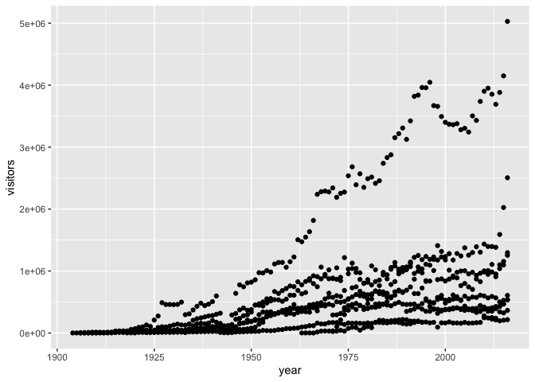

It seems immediately clear that some of the stretches of points belong
to separate parks. It would be helpful to visually distinguish the
parks, wouldn’t it?

### Q5: Mapping park name onto the aesthetics

Duplicate the scatterplot from above, but make the color of points vary
with the park name.

Much nicer! And now we can start to see some differences between parks,
for instance, Yosemite looks to be by far the most visited National Park
in California.

## Multi-pane graphs through facet_wrap()

We can also separate out categorical data that exists in the dataset
into separate panels of graphs that ggplot calls “facets”. That might
make viewing the separate parks a bit easier. We do this with the
`facet_wrap()` or `facet_grid` functions. We’ll use the `facet_wrap()`
function today; `facet_grid()` is a better choice if you want the
columns and rows of the facets to represent different things (but don’t
worry too much about it - I still get confused on which one to use).

Within the function, put the variable name you want to facet followed by
a `~`, and then a `.`: `facet_wrap(variable ~ .)`. The `.` is a
placeholder for a second variable (i.e. its presence indicates that we
are only faceting by one variable).

``` r
ggplot(data = ca_np, mapping = aes(x = year, y = visitors)) +
  geom_point(aes(color = park_name)) +
  facet_wrap(park_name ~ .)
```

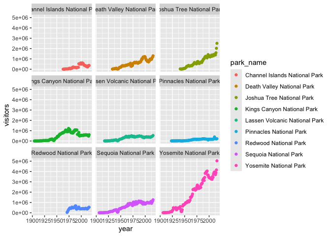

This makes it easier to see individual trends per park, (though it comes
at the expense of graph size, with much smaller panels). Something else
we can modify is the extent of the y-axis. As you can see, the, the
scale of the y axis is fixed here; the visitors to Yosemite go up to
5000000, which makes the trends in the much less popular parks, like
Pinnacles, appear flat. We can change the scales by changing the default
input to the `scales =` argument. In this case, let’s make the y-axis
“free” instead of “fixed”

``` r
ggplot(data = ca_np, mapping = aes(x = year, y = visitors)) +
  geom_point(aes(color = park_name)) +
  facet_wrap(park_name ~ ., scales = "free_y")
```

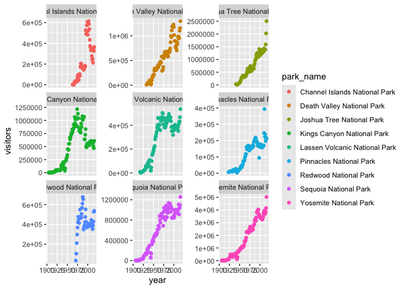

This makes the dynamics for the less popular parks much more clear, but
be careful! Now, every y-axis has a different scale, which will make
park-to-park comparisons difficult or even misleading: Pinnacles and
Yosemite now look very similar at first glance if you don’t do the
mental math while looking at the y-axis values.

# Abalone landings data

In this next part of the activity, you will take what you have learned -
from reading in data to modifying graphs - and apply it to a new dataset
about abalone landings in California: `abalone_landings.csv`. Work
together to do the three things below, and come to us if you have any
questions.

### Q6 Write a research question

Explore this dataset a little bit and then write a research question
that you would like to answer.

### Q7 Make a graph to answer your question

Use what you have learned to make a graph to answer that question. Try
and add a personal twist to the graph (but no stress - the next activity
will be all about customizing graphs and making them prettier/more
readable!).

After you have made a graph, write 1) a sentence or two about what you
have learned from the graph and 2) a follow-up research question (is
there additional data that you might want to acquire for your follow-up
question?).

### Q8 Export the graph

Use your expert googling skills to figure out how to export a graph from
RStudio! (hint: `ggsave()`). After you’ve done that, paste your research
question, graph, what you learned, and your follow-up question into this
slide deck:
<https://docs.google.com/presentation/d/1wAGmbArAW2YKmufrBbzCQ3BcDdwDknzgoRHYEmFXJko/edit?usp=sharing>
